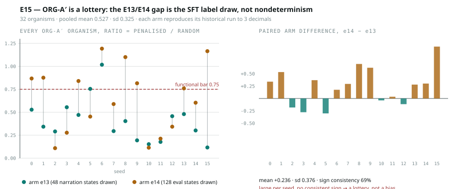

# E15 — ORG-A′ is a lottery, and the E13/E14 gap is the SFT label draw

**git** ~~`1ed22a4`~~ `185b997-dirty` at start, `1ed22a4-dirty` at save ⚠️
*(Correction, 2026-08-14 audit: the manifest records a different dirty SHA at
start than at save — the tree was re-synced mid-run — and this header had
quoted the save SHA with `-dirty` dropped. Same unrecoverable-source defect
E16 is told to repeat for. See REVIEW.md R9.)* · 2026-07-31 · Qwen3-4B + LoRA
r=16 · 16 seeds × 2 arms = 32 ORG-A′ organisms + 32 ORG-D canaries · 34.5 min



---

## Headline

HANDOFF's most important open question was ORG-A′ reading `0.26 / 0.34 / 0.22` in
E13 and `0.87 / 0.88 / 0.11 / 0.28` in E14 — the same organism, the same code,
a gap "five times the measured SFT noise floor", with **no mechanism identified**.

There is a mechanism, it is completely deterministic, and it is not
nondeterminism of any kind.

**Both experiments passed the seed's SHARED generator into `build_examples` after
drawing a different number of unrelated states from it.** E13 drew 48 narration
states; E14 drew 128 eval states. `oracle_move_index` draws once per training
example, so the two experiments wrote **1536 different — individually equally
valid — safe moves** into ORG-A′'s labels.

Replaying both draw orders in one process, same LoRA init, same eval states:

| seed | arm `e13` | E13 v3 reported | arm `e14` | E14 reported |
|---|---|---|---|---|
| 0 | **0.5283** | 0.528 | **0.8679** | 0.868 |
| 1 | **0.3429** | 0.343 | **0.8762** | 0.876 |
| 2 | **0.2909** | 0.291 | **0.1091** | 0.109 |
| 3 | **0.5545** | 0.554 | **0.2772** | 0.277 |

Each arm reproduces its historical run to three decimals. Nothing here was
irreproducible; the two experiments were training measurably different organisms
and calling them the same one.

## The size of the lottery

| | n | mean | sd | min | max | functional (< 0.75) |
|---|---|---|---|---|---|---|
| arm `e13` | 16 | 0.409 | 0.235 | 0.117 | 1.018 | **14/16 (88%)** |
| arm `e14` | 16 | 0.645 | 0.364 | 0.109 | 1.193 | **8/16 (50%)** |
| pooled | 32 | **0.527** | **0.325** | 0.109 | 1.193 | 22/32 (69%) |

**ORG-A′ ranges from 0.109 — a near-perfect organism — to 1.193, worse than
random**, against a pass bar of 0.75. Mean absolute paired difference is
**0.351**, which is half the pass bar. At n=3 or n=4 almost any conclusion is
available, and E13 and E14 each drew one.

**67.4% of the training labels differ between arms**, so the two arms are close
to independent draws from the same label distribution.

## Scoring the pre-committed criteria honestly

Criterion (1) required BOTH `|mean paired diff| > 0.15` AND sign consistency
≥ 75%.

```
mean paired diff   +0.2365      > 0.15     PASSES
sd of that diff     0.3757
t                   2.52  (n=16, p ~ 0.024)
sign consistency    11/16 = 68.8%  < 75%   FAILS
pooled sd           0.3245      >= 0.25
```

**Verdict by the pre-registered rule: VARIANCE, not MECHANISM.**

That verdict is about *direction*, not about whether a cause exists — the cause
is identified and confirmed. What the criteria refuse to license is the stronger
claim that one draw order is systematically better. And they are right to: the
per-seed differences are `+0.34 +0.53 −0.18 −0.28 +0.37 −0.30 +0.18 +0.29 +0.70
+0.62 −0.04 +0.04 −0.11 +0.28 +0.30 +1.05` — five of sixteen point the other way,
and the mean is carried by a handful of large positive values including a +1.05.

A t of 2.5 at n=16 with 69% sign consistency is exactly the shape of evidence
this repo has three times mistaken for a result. **A small directional component
cannot be excluded and would need more seeds.** It is not claimed here.

### The marginals rule out the obvious story

If one arm simply drew *better* labels, its move distribution should differ.
It does not:

```
oracle move marginals, pooled over seeds
  arm e13   0.247  0.241  0.270  0.242
  arm e14   0.261  0.247  0.236  0.256
```

Both near-uniform, and near-identical to each other. The arms do not differ in
*which kind* of move is taught, only in *which* of the equally-valid safe moves
each individual state received. That is a lottery with no describable winner —
which is why it produced an anomaly nobody could explain per seed and looked like
noise in aggregate.

## The determinism canary

ORG-D is untrained and rode along in both arms on every seed.

```
all 16 seeds: e13 == e14, bit-identical
seed 0  0.943396 == 0.943396      seed 2  1.054545 == 1.054545
seed 1  1.104762 == 1.104762      seed 3  1.069307 == 1.069307
```

## 🚩 This retires a standing rule

HANDOFF §8 carries: *"TRAINING IS NOT REPRODUCIBLE RUN-TO-RUN; EVALUATION IS …
ORG-A (800 RL steps, **no code change between the runs**) moved 0.98→0.49,
0.23→0.76, 0.15→0.26. GPU reduction order is nondeterministic and the divergence
compounds over hundreds of gradient steps."*

**There was a code change.** `git diff 1f3d9c8 7e49f0d` shows, inside E13's kind
loop, `set_all_seeds(seed + 1)` → `set_all_seeds(seed)` — and `inject_lora` runs
immediately after it, initialising `lora_A` from the global RNG. v2 and v3 gave
every organism a **different adapter initialisation**. The ORG-A movement is the
deterministic consequence of a seeding change.

Confirming it from the committed data: E13 v3 and E14 share the seeding code and
differ only in the per-seed `gen` stream, and **ORG-A is bit-identical on 4/4
seeds across those two separate runs** (`0.491 0.762 0.255 0.911`). Independently,
a single forward/backward on this GPU was measured to be bit-deterministic
(gradient norm reproduces to 0.000000 across repeats).

So the correct rule is:

> **Runs are reproducible. Organisms are highly sensitive to the adapter-init
> seed and to the SFT label draw.** Those are experimental factors, not noise, and
> naming them as noise is what made three separate discrepancies unexplainable.

The quantities previously called noise floors are sensitivities:

```
run-to-run, identical code and stream      0.000
adapter-init seed          (ORG-A / A′)    0.293 / 0.104      <- was "the noise floor"
SFT label draw             (ORG-A′)        0.351 mean |diff|  <- measured here, first time
```

The 0.104 figure that the E14 gap was called "five times" larger than is the
*adapter-init* sensitivity, estimated from n=3. The relevant denominator for that
comparison is the label-draw sensitivity, which is **0.351** — so the E14 gap is
about one sigma, not five.

## Threats

- **The arm test is degenerate against a robust organism, and this was
  pre-registered.** Both arms share every training *state* and differ only in
  which safe move is written into each completion. Had ORG-A′ been robust to that
  choice, criterion (1) would have failed by construction. It did not fail that
  way — 67% of labels differ and the organism moves by 0.35 — but the experiment
  is powered to answer "is it THIS?", not "what else could it be?".
- **n=16 still cannot resolve a small directional effect.** The +0.237 mean is
  reported and explicitly not claimed.
- **One kind only.** ORG-A′ was chosen because it is where the anomaly was.
  ORG-C also takes oracle moves and is presumably subject to the same lottery;
  ORG-B and ORG-B′ take base-policy moves sampled once outside the loop, so their
  exposure is different and unmeasured.
- **The 0.75 bar is a threshold on a continuous quantity with sd 0.325.** Pass
  counts like "14/16" inherit that instability; the distribution is the result,
  the count is a summary of it.

## What this changes downstream

1. **`build_examples` gets a dedicated RNG per (seed, kind)** — landed in
   `E16.label_generator`, using `zlib.crc32` rather than `hash()` because Python
   randomises string hashing per process and would reintroduce exactly this bug
   across sessions only.
2. **Every ORG-A′ number in E13 and E14 is one draw from a distribution with
   sd 0.325.** Neither run is wrong; both are underpowered, and the disagreement
   between them was never evidence about code.
3. **Organism yield must be reported as a distribution, not a count.** "ORG-A′ is
   the most reliable functional organism, 4/4 vs ORG-A's 2/4" (E13) is not
   supported at n=4.
4. **The E13 v3 anchor test is confounded, not underpowered.** v2→v3 changed the
   adapter init for every organism, so its 0.036 effect cannot be attributed. It
   needs both arms inside one run, which is now the standing pattern.

## Next

- Re-measure the adapter-init sensitivity properly: same labels, N different
  init seeds, one run. E15 measured the label axis; the init axis is still a
  three-point estimate.
- E16 uses the dedicated label RNG, so its organisms are reproducible functions
  of `(seed, kind)`. They are deliberately not the same organisms as E13's or
  E14's — those were never the same as each other either.
