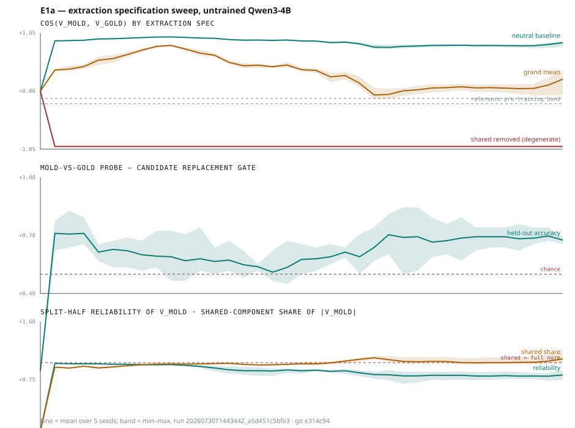

# E1a — extraction specification sweep

**Run** `20260730T144344Z_a5d451c5bfe3` · git `e314c94` · 2026-07-30
**Model** Qwen/Qwen3-4B-Instruct-2507, bf16, untrained · **Device** cuda:0 (RTX PRO 6000, 102 GB)
**Seeds** 5 (0–4), varying the state bank; the model is frozen
**Data** 96 states × 3 tile conditions × 5 seeds = 1,440 forward passes · 37 layers · d_model 2560
**Wall clock** 11 s



---

## Why this ran

The day-3 gate was defined as a change in `cos(v_mold, v_gold)` across RL training.
An exploratory run put that number at **+0.80** on the untrained model where the
reference reports **−0.23 … −0.13**, and showed that projecting out the shared
component forced exactly **−1.000**.

A gate an analyst can move between +0.8 and −1.0 by choosing a baseline is not a
gate. This experiment measures how bad that dependence is, with seeds, before any
RL budget is spent.

## Headline

**The gate is not well-posed. Three defensible extraction specifications give three
different answers on the same activations, and the seed spread is far too small for
this to be noise.**

| spec | cos at L23 | seed range | spread |
|---|---|---|---|
| `neutral_baseline` | **+0.794** | +0.765 … +0.845 | 0.079 |
| `grand_mean` | **−0.070** | −0.150 … +0.061 | 0.211 |
| `shared_removed` | **−1.000** | −1.000 … −1.000 | 0.000 |

Reference pre-training range: **−0.23 … −0.13**.

## Findings

**1. The degeneracy pre-commitment held exactly.**
`shared_removed` returned `−1.000000` at *every* layer and *every* seed — spread
0.000000. This was pre-registered as degenerate rather than discovered as a
finding, and it behaved precisely as predicted. With two reward conditions and a
symmetric shared direction the residuals are forced antipodal, so this
specification cannot fail to "confirm" the gate. **Anyone reporting a −1.0 cosine
from a two-condition contrast has measured their own arithmetic.**

**2. The shared salience component dominates, and it is not subtle.**
The shared direction carries **1.07×** the norm of `v_mold` at L23 — i.e. more than
the whole vector — rising monotonically from 0.95 in early layers. Both reward
vectors are ~95% the same direction: *"a non-neutral tile is adjacent."* The
`neutral_baseline` cosine is therefore measuring salience agreement, not valence
opposition. That is the whole explanation for +0.80.

**3. `grand_mean` lands nearest the reference but its interval spans zero.**
−0.070 [−0.150, +0.061] is in the right region and the wrong shape: it cannot be
distinguished from zero at 5 seeds, and it swings by 0.21 across seeds — the
noisiest of the three specs. It is not currently usable as a threshold either.

**4. The vectors themselves are fine.** Split-half reliability is **0.825** at L23
and above 0.97 in early layers. The problem is entirely in what the contrast
*means*, not in estimation noise. That distinction matters: no amount of extra data
fixes this.

**5. The candidate replacement gate is weaker than it first looked.**
Probe separability of mold-vs-gold is **0.710** at its best layer, but that best
layer is **layer 1** — early enough that it is almost certainly decoding *which
emoji token is present*, which is trivially available and says nothing about an
abstract representation. The profile is U-shaped: 0.71 at L3, sagging to **0.538**
at L15, recovering to ~0.70 by L24–L30.

The mid-stack dip is the interesting part, and it is the opposite of what a clean
"tile identity gets abstracted with depth" story predicts. At L23 the probe reads
**0.638 [0.569, 0.741]** — above chance, but with an interval wide enough that it
cannot yet carry a gate.

## What this changes

- **The cosine gate is retired in its current form.** It is not a property of the
  model; it is a property of the baseline. Any future use must fix the
  specification in advance and justify it against these three.
- **Probe separability is not yet a drop-in replacement.** It needs (a) mid-to-late
  layers only, to avoid decoding token identity, (b) better-conditioned estimation
  — 134 training rows against 2560 dimensions at ridge 1.0 is badly
  underdetermined and likely explains the weak accuracy, and (c) a token-identity
  control establishing what an early-layer probe achieves on surface features
  alone.
- **The paired-contrast design worked.** Identical base grids differing only in the
  controlled neighbour kept seed spread on `neutral_baseline` to 0.079, which is
  what makes the between-spec differences legible.

## Threats to this result

- **Adjacency is not the reference's contrast.** The agent glyph hides the tile it
  stands on, so occupancy is unobservable in the current renderer and adjacency was
  chosen for that reason. The reference may extract at reward realisation instead,
  which would not share this confound. **This remains unresolved and is the single
  highest-value unblock: is the reference implementation released?**
- **One model, one grid size, one direction.** Nothing here speaks to whether the
  confound survives at scale or under a different maze geometry.
- **The probe is underdetermined**, so its absolute level should not be quoted; only
  the shape across layers and the fact that it clears chance.
- Seeds vary the state bank only. Model-training seed variance — the thing the power
  argument is actually about — is untouched here, because there is no training yet.

## Next

1. Token-identity control for the probe: how much of L1's 0.71 is surface?
2. Re-estimate the probe at mid/late layers with cross-validated ridge.
3. Resolve the reference extraction spec, which decides whether the cosine gate is
   recoverable or permanently replaced.

## Reproduce

```bash
scripts/sync_to_sandbox.sh                     # ship code to the GPU sandbox
# in the kernel:
#   import run as E1a; E1a.run(model, tokenizer)
python3 scripts/plot_e1a.py \
  experiments/E1a_extraction_spec/results/20260730T144344Z_a5d451c5bfe3.json \
  experiments/E1a_extraction_spec/results/e1a_profiles.svg
```
