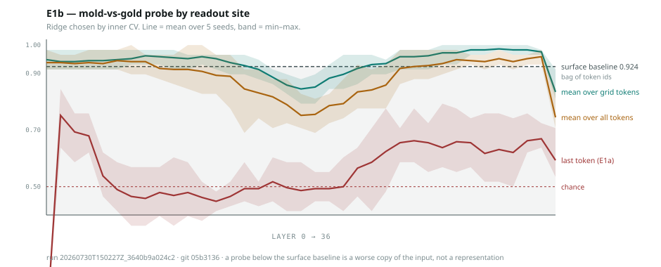

# E1b — probe readout site, against a surface baseline

**Run** `20260730T151157Z_16695a552eed` · git `8ccef88` · 2026-07-30
**Supersedes** `20260730T150227Z_3640b9a024c2` (same code, misspecified CV grid — kept for the record)
**Model** Qwen/Qwen3-4B-Instruct-2507, bf16, untrained · **Seeds** 5 · **Wall clock** 28 s



---

## Why this ran

E1a nominated mold-vs-gold probe separability as the replacement gate after the
cosine gate proved baseline-dependent, then measured it at only **0.638** mid-stack.
E1b asked whether that reflected the model or the **readout site** — E1a read the
final prompt token, but the grid appears far earlier.

## Headline

**Tile identity is decodable essentially everywhere. The probe is not too weak to
gate on — it is too strong, and that is worse.**

| readout | best layer | acc | @ L23 | layers > 0.95 |
|---|---|---|---|---|
| `last` (E1a's) | L3 | 0.976 | 0.721 | 4 / 36 |
| `mean_all` | L22 | **0.990** | 0.990 | 35 / 36 |
| `mean_grid` | L32 | 0.986 | 0.983 | **36 / 36** |

Surface baseline (bag of token ids): **0.924** [0.879, 0.983].

## Findings

**1. A gate needs headroom, and this one has none.**
`mean_grid` is above 0.95 at *every layer of the untrained model*. A gate is
supposed to detect a change induced by RL; a quantity already at 0.98 before
training cannot go up. **Probe separability is disqualified as the day-3 gate —
by ceiling effect, not by weakness.** This is the opposite of the previous
reading and it is the main result here.

**2. Identity is not value, and only value should move.**
In hindsight the ceiling is unsurprising: which tile is adjacent is *literally in
the input as a distinct glyph*, so any competent model encodes it before training.
What RL is supposed to change is not whether mold and gold are *distinguishable*
but whether they become *oppositely valued*. The probe measures identity. The
cosine was trying to measure value and failed for a different reason. **Neither
current candidate measures the thing the gate is about.**

**3. Readout site still matters, but differently than reported.**
With the corrected grid, `last` reaches 0.976 at L3 — above the surface baseline —
then decays monotonically to ~0.66 by L36. Grid-pooled readouts stay flat and high.
So the last-token site is not disqualified outright; it carries the information
early and loses it with depth. E1b's first pass called it "disqualified at every
layer," which was wrong.

**4. I over-concluded twice, and both times a control caught it.**
- E1a read one site and concluded the model barely represents tile identity. Wrong —
  readout artefact, caught by adding pooled readouts.
- E1b's first pass used a CV grid whose optimum lay outside it and concluded the
  last-token readout was disqualified. Wrong — caught by noticing every selection
  pinned to the lower bound.

Both errors ran in the same direction: **a defective measurement made the model look
less structured than it is.** That is worth carrying forward as a prior, because the
whole program is built on measurements of exactly this kind.

## What this changes

- **The day-3 gate is now unresolved.** Cosine: baseline-dependent. Probe: saturated.
  Neither is usable as specified.
- **Candidate that survives both failure modes** — a *functional* rather than
  representational measure: project activations onto the mold-vs-gold direction and
  ask whether that projection **predicts the model's move**. Pre-training it should
  not (the model has no reason to act on tile identity); post-training it should.
  It cannot saturate beforehand, and it has no baseline to choose. **This should be
  measured before any RL run**, as the pre-training half of a gate.
- Quoting rule: report the CV alpha grid and confirm the optimum is interior.

## Threats to this result

- **The paired design inflates absolute accuracy.** Mold and gold banks share a seed,
  so each test item has a near-twin in train differing only in the labelled tile.
  That is intentional and makes the contrast clean, but the numbers are not
  comparable to an unpaired probe and should not be quoted as general decodability.
- **Untrained model, adjacency contrast** — still not the reference's extraction. The
  release question remains the highest-value unblock.
- `mean_grid` sees only grid tokens where the manipulated glyph lives; the surface
  baseline sees the whole prompt. Not fully like-for-like.
- Seeds vary the state bank only; no training has happened, so training-seed variance
  is untouched.

## Next

1. **Functional gate candidate** — does the tile direction predict the move? Pre-training.
2. First RL run for the per-run cost figure.
3. Fix whichever gate survives in writing before organisms are built.

## Reproduce

```bash
scripts/sync_to_sandbox.sh
# in kernel:  import run as E1b; E1b.run(model, tokenizer)
python3 scripts/plot_e1b.py \
  experiments/E1b_probe_readout/results/20260730T151157Z_16695a552eed.json \
  experiments/E1b_probe_readout/results/e1b_readout.svg
```
