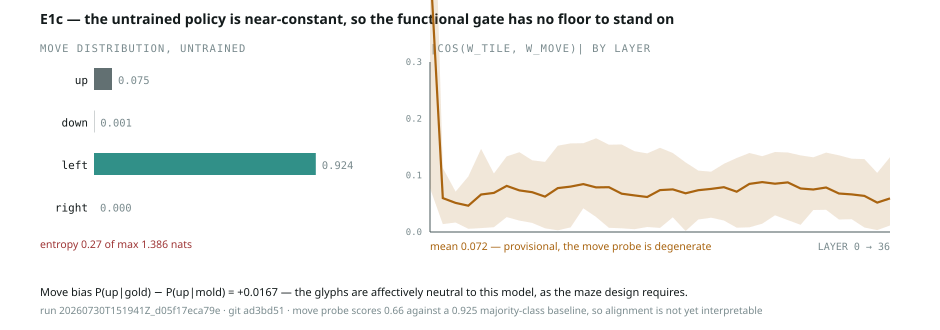

# E1c — functional gate candidate: is tile identity action-relevant?

**Run** `20260730T151941Z_d05f17eca79e` · git `ad3bd51` · 2026-07-30
**Model** Qwen/Qwen3-4B-Instruct-2507, bf16, untrained · **Seeds** 5 · **Wall clock** 28 s



---

## Why this ran

Two gate candidates had failed for opposite reasons — the cosine is
baseline-dependent (E1a), probe separability is saturated (E1b). Shared diagnosis:
both measure *representation*, but tile identity is in the input as a distinct
glyph, so it is encoded before training. RL should change what the model **acts
on**, not what it can distinguish. E1c measures alignment between the
tile-identity direction and the move-prediction direction.

## Headline

**One clean positive, one clean negative — and both were pre-committed.**

- ✅ **The glyphs are affectively neutral to this model.** Move bias
  `P(up|gold) − P(up|mold) = +0.0167` [−0.010, +0.052]. The maze design's core
  premise holds: nothing about 🟦 versus 🟪 moves the untrained policy.
- ❌ **The untrained policy is near-constant, so the gate has no usable floor.**
  The model answers **`left` 92.4%** of the time and **`right` 0.0%**. Entropy
  0.27 of a maximum 1.386 nats.

## Findings

**1. Glyph neutrality confirmed, and it matters more than the negative.**
This is the assumption everything downstream rests on: if the base model already
treated the two tiles differently, ORG-A would not be a clean
state-without-script organism, and the whole contrast would be confounded from
the start. It doesn't. `+0.017` across 5 seeds is as close to nothing as this
design can measure.

**2. The move probe is degenerate, and worse than trivial.**
With `up` at 7.5% and everything else at 92.5%, a majority-class predictor scores
**0.925**. The activation probe scores **0.60–0.69**. It is not weakly
informative — it is *worse than guessing the majority*, which is what an
imbalanced fit with no signal looks like. E1c's docstring pre-committed that a
near-deterministic move distribution would make the run uninterpretable. It did.

**3. Alignment is therefore provisional.** `|cos(w_tile, w_move)| ≈ 0.077`
[0.007, 0.157], flat across depth. That is "low but not zero," as pre-committed —
but it is computed against a `w_move` fitted on a degenerate label, so it should
not be quoted as the gate's pre-training floor.

**4. The near-constant policy is a consequence of the design, not a defect in it.**
The prompt deliberately states no goal — that is what makes ORG-A affect-free and
script-free. With no objective, the response is driven by lexical priors rather
than the grid, so a constant answer is exactly what should be expected. The
finding is not "the model is broken"; it is **"there is no behavioural variance to
align with until RL creates some."**

## What this changes

- **The binary-argmax formulation is the wrong readout.** Replace the label with
  the **continuous logit margin** for the toward-move — `logit(up) − logsumexp(rest)`.
  It has variance even when the argmax never changes, which removes the degeneracy
  without touching the design.
- **The floor is structurally near-zero, which is what a gate wants** — but E1c
  cannot yet certify the value, only the direction of the argument.
- **RL has enormous headroom.** Shifting a policy that is 92% `left` and 0% `right`
  is a large, easily measured change. Whatever else is uncertain, ORG-A's
  manipulation check (avoidance ≫ chance) will not be subtle.

## Threats to this result

- Alignment is computed from a degenerate move probe — provisional, as above.
- One controlled direction (`up`). A model with a strong `left` prior may behave
  differently when the manipulated tile sits on the side it already prefers;
  the direction should be varied.
- Untrained model, adjacency contrast, paired banks — same caveats as E1a/E1b.
- The `left` prior may be an artefact of the move-word list order in the prompt
  (`up, down, left, right`). Untested, and cheap to test by permuting it.

## Next

1. **Re-run with the continuous logit margin** instead of binary argmax. Minutes.
2. **Permute the move-word order** in the prompt to check the `left` prior is not
   positional. Minutes, and it bears on prompt design for every organism.
3. First RL run — per-run cost, and the first genuine behavioural variance.

## Reproduce

```bash
scripts/sync_to_sandbox.sh
# in kernel:  import run as E1c; E1c.run(model, tokenizer)
python3 scripts/plot_e1c.py \
  experiments/E1c_functional_gate/results/20260730T151941Z_d05f17eca79e.json \
  experiments/E1c_functional_gate/results/e1c_gate.svg
```
