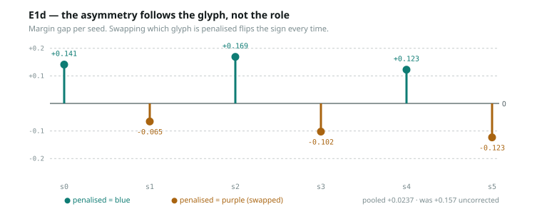

# E1d — the corrected floor: both confounds removed

**Run** `20260730T152854Z_bac34f229f96` · git `fc01f2e` · 2026-07-30
**Model** Qwen/Qwen3-4B-Instruct-2507, bf16, untrained · **Seeds** 6 (counterbalanced)



---

## Headline

**Both fixes worked, and the counterbalancing produced a clean controlled result:
the tile asymmetry follows the *glyph*, not the *role*.**

| seed | penalised glyph | margin gap |
|---|---|---|
| 0 | 🟦 blue | **+0.1411** |
| 1 | 🟪 purple (swapped) | **−0.0654** |
| 2 | 🟦 blue | **+0.1690** |
| 3 | 🟪 purple (swapped) | **−0.1021** |
| 4 | 🟦 blue | **+0.1225** |
| 5 | 🟪 purple (swapped) | **−0.1232** |

Unswapped mean **+0.144**, swapped mean **−0.097**, pooled **+0.024**
(uncorrected: +0.157).

**The sign flips every time the glyph assignment flips.** Six for six.

## Findings

**1. The asymmetry is a colour prior, and it is now cancelled.** E1c-2's +0.157
gap could have followed the *role* (penalised vs rewarded) — which would have been
serious, since ORG-A's whole premise is that the roles are affectively neutral
before training. It follows the *glyph*: the model mildly prefers moving toward 🟪
over 🟦, and that is all. Counterbalancing collapses it to +0.024 pooled.

This was the pre-committed discriminator and it came out the benign way.

**2. Order randomisation broadened the policy exactly as intended.**

| | up | down | left | right | entropy |
|---|---|---|---|---|---|
| fixed order (E1c) | 0.076 | 0.000 | **0.924** | 0.000 | 0.270 |
| randomised (E1d) | 0.041 | 0.319 | 0.179 | 0.461 | **1.150** |

Entropy 0.270 → **1.150** of a maximum 1.386. The degenerate policy was an
artefact of the prompt, and it is gone.

**3. The gate floor is low and stable: `|cos(w_tile, w_move)|` mean 0.051 across
layers, max 0.089.** Slightly *lower* than the uncorrected estimate (~0.09–0.14),
which is the right direction — the corrections removed structure rather than
introducing it, as pre-committed. **This is the number RL has to move.**

**4. New cost, recorded: randomisation injected noise into the margin target.**
Margin R² per seed is now **[0.688, 0.157, 0.427, 0.023, 0.398, 0.619]** against
E1c-2's stable 0.68–0.83. The margin for `up` now depends on where `up` happens to
sit in that sample's list, and that position varies per sample. On seeds where R²
is near zero, `w_move` is fitted on noise and that seed's alignment is not
meaningful.

**Fix for next run:** present each grid under several orders and average the
margin, which marginalises position out instead of leaving it as per-sample noise.
Costs forward passes, not design.

## What this changes

- **Both corrections are adopted permanently.** `random_move_orders` and
  `role_glyphs` are in `src/calibration/`, and every organism must use them.
- **The maze design's neutrality premise survives** — with a caveat now measured
  rather than assumed: the glyphs are not *identical* to the model, but the
  asymmetry is colour-bound and cancellable.
- **The gate has a floor: ~0.05, max 0.089.** Non-degenerate, far from ceiling.
- Alignment should be pooled across seeds weighted by margin R², or seeds with
  R² below ~0.2 dropped, until the averaging fix lands.

## Threats to this result

- **Margin R² is unstable across seeds** (0.02–0.69), so per-seed alignment
  varies in reliability. The pooled floor is sound; individual seeds are not.
- Six seeds, one grid size, one controlled direction (`up`).
- Counterbalancing is by seed parity, so glyph and seed are perfectly confounded
  — fine for cancelling a main effect, useless for detecting a glyph × seed
  interaction.
- Untrained model throughout.

## Next

1. Average the margin over several move orders per grid; re-estimate the floor.
2. **First RL run** — the prompt is now safe to train on.

## Reproduce

```bash
scripts/sync_to_sandbox.sh
# in kernel:  import run as E1d; E1d.run(model, tokenizer)
```
