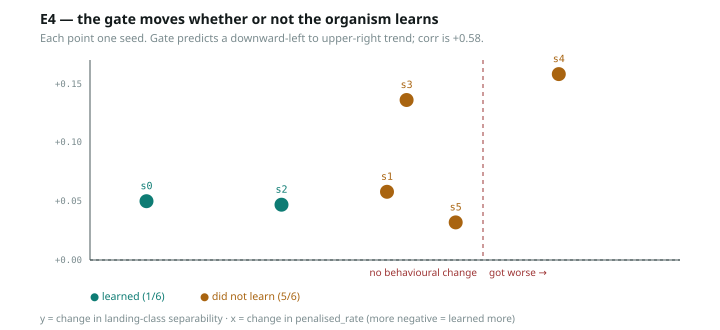

# E4 — the gate fails: it moves whether or not the organism learns

> ⚠️ **RETRACTED HEADLINE** *(banner added 2026-08-14; the retraction itself is
> from E5)*: E5 measured 90% of E4's separability rise to be class-composition
> drift that reproduces with the weights frozen. Also note the `git` SHA below
> exists nowhere in this repository's history (E4 has no committed `run.py`;
> its per-seed JSON is committed). See REVIEW.md R9, D11.

**git** `9a3c17e` · 2026-07-30 · Qwen3-4B + LoRA r=16 · Dr.GRPO, 300 steps,
lr 1e-4, entropy_coef 0.01 · 6 counterbalanced seeds · ~75 s/seed

---

## Results

| seed | penalised_rate → | random baseline | learned? | Δ separability | cos before → after |
|---|---|---|---|---|---|
| 0 | 0.188 → **0.051** | 0.209 | **YES** | +0.050 | +0.343 → −0.046 |
| 1 | 0.254 → 0.215 | 0.218 | no | +0.058 | +0.792 → +0.178 |
| 2 | 0.223 → **0.141** | 0.219 | **YES** | +0.047 | −0.374 → +0.722 |
| 3 | 0.215 → 0.184 | 0.214 | no | +0.136 | −0.077 → +0.899 |
| 4 | 0.215 → 0.246 | 0.215 | no *(worse)* | **+0.158** | +0.256 → +0.484 |
| 5 | 0.195 → 0.184 | 0.208 | no | +0.032 | +0.764 → +0.664 |

## Three findings, all negative

**1. Landing-class separability rose in 6/6 seeds — including every seed that
failed to learn.** Mean +0.080. The gate was pre-registered on the prediction that
it should rise *because* RL makes the model care where its move lands. It rises
when RL does nothing of the kind, so it is measuring *"weights changed"*, not
*"a functional state was acquired"*.

**2. The correlation runs the wrong way.** `corr(Δrate, Δsep) = +0.579`. The gate
predicts **negative** — more learning (more negative Δrate) should mean more
separability. Instead the seed with the **largest** separability gain (seed 4,
+0.158) is the one whose behaviour got **worse**, and the best organism (seed 0,
Δrate −0.137) has among the **smallest** gains. n=6, so the coefficient itself is
not worth much — but the direction is wrong and the extremes are unambiguous.

**3. The cosine has no consistent direction.** Changes range −0.614 to +1.096.
Two seeds moved strongly *positive*, the opposite of what recruitment predicts.
It is not a gate; it is noise at this sample size.

## And the organism is unreliable — 2/6

Only seeds 0 and 2 cleared the bar (`rate < 0.75 × random`). Seed 4 got worse.

**The likely reason is my error, and it is the one I would flag in someone else's
work: `entropy_coef = 0.01` was selected by a sweep run on seed 0 only, then
evaluated on seeds 0–5.** Seed 0 being the standout is exactly what selecting a
hyperparameter on one seed and reporting it on that seed produces. The honest
reading of "seed 0 works" is "the configuration was fitted to seed 0."

## What this means for the program

Four gate candidates have now failed, each differently:

| candidate | failure |
|---|---|
| cosine, prompt-token | baseline-dependent: +0.79 / −0.07 / −1.00 on identical activations |
| probe separability, prompt-token | saturated at 0.98 untrained |
| tile↔move alignment | usable floor, but no external anchor |
| **landing-class separability** | **moves on training, not on learning** |

The common thread is worth stating: **every candidate was validated against
untrained models only, and each looked fine there.** The failure appears the
moment there is a trained organism to compare against — which is an argument for
building the organism *first* and the gate *against it*, the opposite of the order
I argued for and took.

**A gate cannot be validated without at least one organism known to have learned
and one known not to have.** E4 finally supplies both (seeds 0 and 2 vs 1, 3, 4,
5), so it is the first run in this program that could have falsified a gate at
all. It falsified the gate.

## Threats

- **n=6, one configuration, 300 steps.** Everything here could change with longer
  training or per-seed tuning.
- **Hyperparameter selected on seed 0** (above). Any future run must tune on a
  held-out seed set.
- `Δsep` is measured against a floor that itself varies 0.582–0.622 across seeds,
  which is a substantial fraction of the +0.080 mean change.
- Trajectories are re-rolled *by the trained policy*, so the class balance shifts
  between the before and after measurements. A policy that avoids the penalised
  tile generates fewer penalised trajectories, which changes the probe's class
  sizes. **This is a real confound and could alone explain a separability change.**
  It should be controlled by fixing the evaluation trajectory set.

That last threat is the first thing to test. It is entirely possible the whole
+0.080 is class-imbalance drift.

## Next

1. **Control the class-balance confound** — evaluate the gate on a *fixed*
   trajectory set generated by the untrained policy, scoring both models on it.
2. Tune hyperparameters on held-out seeds; get ≥4/6 organisms learning.
3. Only then re-test any gate.
