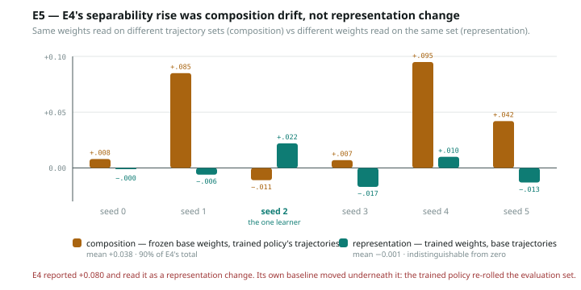

# E5 — E4's separability rise was class-composition drift. The representation effect is zero.

**git** code as committed in `3da25d8` · 2026-07-30 · Qwen3-4B + LoRA r=16 · Dr.GRPO 300 steps,
lr 1e-4, entropy_coef 0.01 (identical to E4, deliberately) · 6 counterbalanced
seeds · 3,000 trajectories per cell · ~5 min/seed

> **Provenance note.** The results JSON manifest records `git_sha 043bf8a`, the
> HEAD at the moment the sandbox was synced. The crash-resilience and
> dirty-model-guard edits were synced before being committed and landed
> afterwards as `3da25d8`. The code that produced these numbers is the code in
> `3da25d8`; the manifest SHA is one commit stale and should not be trusted over
> this line.

---

## Headline

E4 reported that landing-class separability rose +0.080 after RL and read that as
a change in the representation. **It was not.** Holding the trajectory set fixed
and changing only the weights moves separability by **−0.001**.

| effect | what moved | raw | balanced |
|---|---|---|---|
| total, E4's protocol | weights **and** trajectories | +0.041 | +0.081 |
| **composition** | trajectories only, **weights frozen** | **+0.038** | **+0.076** |
| **representation** | weights only, trajectories fixed | **−0.001** | +0.016 |
| interaction | residual | +0.005 | −0.011 |

**Composition accounts for 90% of the raw effect and 94% of the balanced one.**
The representation term is indistinguishable from zero in the raw arm.

The `sep_bt` cell is the one that settles it. Those weights are bit-identical to
the ones that produced `sep_bb` — no training has touched them. Separability rises
anyway, purely because the trajectories fed in came from a different policy.

## Per seed

| seed | rate → (rand) | learned | bb | bt | tb | tt | composition | representation |
|---|---|---|---|---|---|---|---|---|
| 0 | 0.195 → 0.188 (0.207) | no | 0.633 | 0.641 | 0.633 | 0.659 | +0.008 | −0.000 |
| 1 | 0.227 → 0.227 (0.205) | no | 0.636 | 0.721 | 0.631 | 0.688 | **+0.085** | −0.006 |
| 2 | 0.227 → **0.148** (0.215) | **YES** | 0.654 | 0.643 | 0.676 | 0.691 | −0.011 | **+0.022** |
| 3 | 0.211 → 0.172 (0.197) | no | 0.629 | 0.636 | 0.613 | 0.619 | +0.007 | −0.017 |
| 4 | 0.219 → 0.250 (0.232) | no *(worse)* | 0.643 | 0.738 | 0.652 | 0.741 | **+0.095** | +0.010 |
| 5 | 0.234 → 0.211 (0.207) | no | 0.632 | 0.674 | 0.618 | 0.678 | +0.042 | −0.013 |

`bb` = base weights on base trajectories · `bt` = **base weights** on trained
trajectories · `tb` = trained weights on base trajectories · `tt` = both trained.

## Pre-commitments, scored

| # | prediction | outcome |
|---|---|---|
| 1 | composition clearly positive, +0.03 to +0.10 | **hit** — +0.038 raw, +0.076 balanced |
| 2 | representation smaller than E4's +0.080 | **hit, and stronger than predicted** — it is ~0 |
| 3 | interaction small enough that the split is meaningful | **hit** — +0.005 raw, −0.011 balanced |
| 4 | balancing shrinks the composition effect but does not abolish it | **MISS** — balancing *doubled* it, +0.038 → +0.076 |

Pre-commitment 4 is worth dwelling on because I had the mechanism half right and
the direction wrong. I predicted balancing would partly repair the protocol.
It does not repair it at all — it makes the artefact larger. Equalising class
*sizes* does nothing about class *contents*, and the contents are what differ: a
trained policy's penalised trajectories are the residue left after avoidance, not
a smaller random sample of the same thing. **Balancing is not a fix for this
confound, and anyone reaching for it as one — as I would have — is wrong.**

## The mechanism, visible in the counts

Landing-class counts, penalised/rewarded/path, base → trained:

| seed | base | trained | penalised drift |
|---|---|---|---|
| 0 | 545/340/2115 | 546/360/2094 | +0.2% |
| 1 | 339/517/2144 | 347/634/2019 | +2.4% |
| 2 | 546/340/2114 | **291**/334/2375 | **−46.7%** |
| 3 | 326/497/2177 | 358/588/2054 | +9.8% |
| 4 | 525/334/2141 | 588/356/2056 | +12.0% |
| 5 | 315/595/2090 | 381/585/2034 | +20.9% |

Seed 2 — the only organism that learned — nearly halves its penalised class,
exactly as predicted: an avoider stops generating the trajectories the probe needs.
Every other seed drifts too, in both directions.

Note that count drift does **not** track the size of the composition effect
(seed 2 drifts most and has the *smallest* composition effect; seed 4 drifts 12%
and has the largest). So the artefact is not a simple class-size effect — which is
the same conclusion the balanced arm reached by a different route, and the reason
both arms are reported.

## An incidental confirmation: the glyph colour prior is real at the action token

Base-policy penalised counts split cleanly by seed parity — 545/546/525 on even
seeds, 339/326/315 on odd. Counterbalancing swaps which glyph is penalised on odd
seeds, so this is the untrained model preferring to step onto **blue** regardless
of what blue means, at roughly a 1.7× rate.

E1d found this prior in the prompt. It is still here at the emitted action, it is
large, and **counterbalancing is doing real work** — an uncounterbalanced version
of this experiment would have had a 1.7× class asymmetry baked into every cell.

## Threats, and one that is serious

- **E5 does not reproduce E4's behaviour, and `reproduces_e4` is `false`.** E4 had
  seed 0 at 0.188 → 0.051 and 2/6 learning. Here seed 0 goes 0.195 → 0.188 and
  only 1/6 learns. The separability *floors* reproduce within 0.05 on 5 of 6 seeds,
  which is why the decomposition is still meaningful, but the organisms are not the
  same organisms.

  The cause is a reproducibility hole of my own making: **E4 was driven ad hoc
  through the kernel and never got a `run.py`**, so its exact call sequence is
  unrecoverable. E5 inserts a 3,000-episode rollout between `evaluate_policy` and
  `train_org_a` that E4 did not have. Every experiment from here gets a committed
  `run.py` before it is allowed to produce a number.

  It also further undermines E4's seed 0. That was the seed `entropy_coef` was
  tuned on, it was E4's best organism, and it does not survive a change in the RNG
  path. The most likely reading is that it was a fluke the tuning locked onto.

- **1/6 organisms learned.** The representation term is therefore an average over
  five non-learners and one learner. "Representation effect ≈ 0" is mostly a
  statement about models that did not acquire anything, which is not surprising.

- **n=6, one configuration.** As in E4.

- The balanced arm is underdetermined (~300 rows vs 2,560 dims at fixed ridge 1.0),
  so its absolute accuracies are not interpretable. Only the between-cell
  differences are, because every cell carries the identical penalty, class size and
  split.

## What survives, and one thing that got more interesting

**E4's headline number is retracted.** The +0.080 was not a representation change.

**But the gate is not dead — it is untested.** E4 asked whether separability rises
with training, measured it through a confound, and got "yes, even when nothing is
learned." With the confound removed, the honest state is that *the representation
barely moves at all*, and the one seed that learned has the largest representation
effect in the balanced arm (+0.065 against a non-learner mean of +0.007).

**That is n=1 and seed 3 is a non-learner at +0.041, so it is a hypothesis and
not a result.** But it is the first time in this program that the quantity has
pointed the right way. Testing it needs organisms that reliably learn, which is
now unambiguously the blocking problem.

## Next

1. **Fix organism yield.** Tune on held-out seeds (never seed 0 alone), target
   ≥4/6. Everything downstream is blocked on this and has been for two experiments.
2. Re-run this decomposition with ≥4 learners and test whether the representation
   term separates learners from non-learners.
3. Backfill a `run.py` for E4, or mark its numbers as superseded by E5's.
